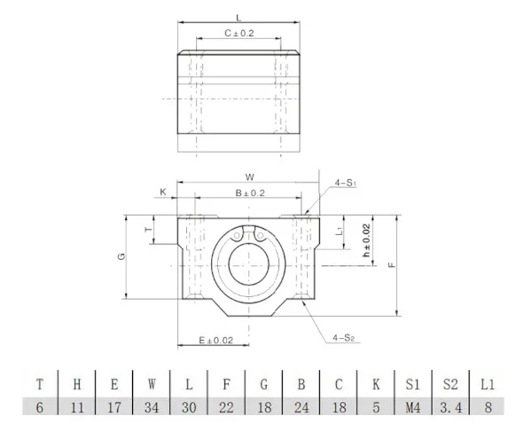

links:
* https://www.repetier.com/
* https://github.com/marlinfirmware/marlin
* how to install and configure marlin: https://www.youtube.com/watch?v=38PkynA1uGI

## SCS8UU dimension

## connections

anet a8 board <--> real component

SY connector (stop Y axis) -> stop y axis button

Y motor  <-> right Y axis stepper 
E motor < -> left Y axis stepper 